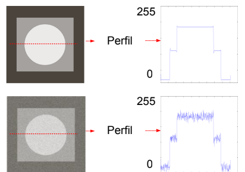
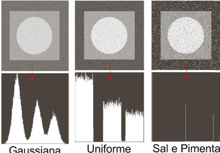
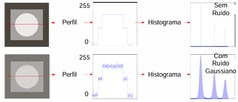

# Análise de ruído
## Sumário 
1. [Objetivo](#objetivo)
2. [Visão Geral](#visão-geral)
3. [Tipos de ruídos](#tipos-de-ruídos)
4. [Histograma](#histograma)
5. [Avaliação de Filtros](#avalição-de-filtros
)
## Objetivo
* **Análise de Degradação:** Compreender como a função de degradação e a adição de ruído afetam a imagem original.
* **Aplicação de Filtros:** Implementar processos de filtragem para tentar restaurar os valores ideais da imagem.
* **Avaliação Quantitativa:** Utilizar métricas estatísticas para mensurar a eficácia dos filtros na redução de ruídos sem a perda de informações essenciais.
## Visão geral
Valores aleatórios que alteram de forma destrutiva as intensidades originais da imagem. 

## Tipos de ruídos 
* **Gaussiano:** diferentes variações de intensidades do ruído são correspondentes a uma distribuição gaussiana. 
* **Uniforme:** este ruído é um tipo de degradação em que os valores de intensidade adicionados à imagem são distribuídos de forma uniforme.
* **Sal e pimenta:** caracterizando-se por alterações bruscas e pontuais nos pixéis.

## Histograma 
Reproduz a distribuição de valores de intensidade.

## Avalição de filtros 
### 1. Degradação
Adição de ruídos na imagem original, o que resulta em uma imagem ruidosa.
### 2. Restauração
Através da **filtragem** tem-se a recuperação aproximada dos valores originais da imagem.
### 3. Avaliação quantitativa de filtros
 Deve quantificar por métricas o quanto um filtro reduz os efeitos destrutivos de 
ruídos, sem prejudicar as informações. Quantifica o quão próximo está a imagem apróxima da imagem original. 
#### 3.1) Raiz do Erro Médio Quadrático ($RMSE$)
$RMSE = \sqrt{\frac{\sum_{i=1}^{N} (f_i - g_i)^2}{N}}$ 

Quanto menor o RMSE, mais parecida é a imagem aproximada da imagem aproximada.
#### 3.2) Erro máximo 
$E_{max} = \max|f_i - g_i|$
 Representa o desvio máximo absoluto encontrado entre os pixéis da imagem original ( $f_i$ ) e os da imagem restaurada ou ruidosa ( $g_i$ )4.
 #### 3.3) Fator de qualidade da imagem 
 * É o mais completo entre a avaliação quantitativa de filtros. 
 * Leva em conta:

    1) Detalhes

    2) Contraste / Brilho 

    3) Distorção
$$Q = \frac{\sigma_{fg}}{\sigma_f \sigma_g} \cdot \frac{2\bar{f}\bar{g}}{\bar{f}^2 + \bar{g}^2} \cdot \frac{2\sigma_f \sigma_g}{\sigma_f^2 + \sigma_g^2}$$
## Sintaxe funções utilizadas
from skimage.util import random_noise

imagem_ruidosa = random_noise(imagem_original, mode='gaussian', mean=0, var=0.01)

* Parâmetros:
1. **mode:** define o ruído.
2. **mean:** média do ruído.
3. **var:** variância.
4. **clip = True:** Garante que, após somar o ruído, os pixels não ultrapassem os limites de $[0, 1]$ - imagem normalizada.

