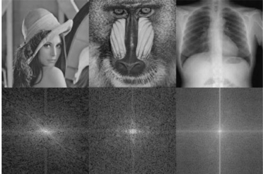
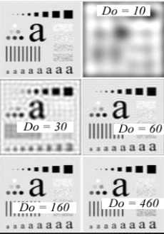

## Aula 6: Processamento de imagem no domínio da frequência
### Objetivos
Implementar e analisar o desempenho de filtros digitais Passa-Baixa (Ideal e Butterworth) no domínio da frequência. O projeto visa explorar a manipulação do espectro de Fourier ($F(u,v)$) para realizar operações de filtragem, garantindo a correta aplicação de técnicas de padding para evitar artefatos de borda e otimizar a reconstrução da imagem final ($g(x,y)$).
### Contexto
* Cada imagem possui uma distribuição de energia diferente no domínio da frequência.
* **Ponto central:** em todos os espectros, o centro é o ponto mais brilhante, que representa a **frequência zero (componente DC)**, onde se concentra a **maior** parte da energia da imagem (as baixas frequências que definem a forma geral).

### Duas formas equivalentes de chegar a imagem filtrada
- **Domínio Espacial(pixels):** pegamos a imagem inicial f(x,y) e realizamos uma **convolução** com um kernel h(x,y).  
**g(x,y) = f(x,y) * h(x,y)**
* **Domínio da frequência:** **1.** Trasformar a imagem inicial f(x,y) para o domínio da frequência obtendo F(u,v); **2.** Multiplica o espectro de frequência pela função de transferência do filtro H(u,v); **3.** Temos como resposta a correspondente no domínio da frequência filtrada G(u,v). **4.** Após aplicar a tranformada de Fourier inversa, temos uma imagem filtrada no domínio do tempo. 
### Relembrando TF
Na transformada de Fourier centralizada, as informações das imagens são organizadas como: 
* **No centro:** estão as baias frequências (cores suaves e as formas grandes da imagem).
* **Longe do centro:**  frequências mais altas (detalhes finos, bordas e os ruidos). 
##### Para decidir o que filtrar, o computador calcula a distância eucliadiana de cada ponto (u,v) até o centro da imagem.  $$D = \sqrt{distx^2 + disty^2}$$
* Se D for pequena, estamos perto do centro (frequência baixa).
* Se D for grande, estamos longe do centro (frequência alta).
##### **Banda passante:** refere-se as frequências que o filtro deixa passar. 
### Função de transferência (filtro 2D ideal)
* Primeiro filtro ideal: Filtro Passa-Baixa Ideal (ILPF).
#### Característica do filtro: 
* **Banda passante plana:** dentro dos valores de frequência que o filtro deixa passar, este por sua vez não altera nenhum valor de frequência dentro deste limite. 
* No filtro Ideal, a transição é um degrau perfeito.**Matematicamente:** Se a distância do ponto for $10,001$ e sua frequência de corte ($D_0$) for $10$, aquele ponto é multiplicado por 0 e desaparece instantaneamente. 
#### [Código para filtro ideal](mascara_ideal.py)
### Efeito da frequência de corte na imagem
Aumentar a frequência de corte para um filtro Passa-Baixas ideal faz com que uma maior quantidade de frequência passe. Sendo assim, mantemos a imagem no seu formato inicial. 

#### Cáculo do D0
* 1 . Imagens quadradas:  
 
Se a minha fc = 0,5(ou seja, 50% da frequência máxima), como a minha imagem tem 2000x2000, então a figura filtrada terá um raio de 500 pixels.
* 2.Imagens não quadradas: 
A discretização de frequência na vertical e na horizontal são diferentes. Calculamos o raio de fc na horizontal e na vertical. Teremos 2 valores de raio, com isso, conseguimos calcular uma elipse de tal forma que teremos 50% da frequência máxima tanto horizontalmente quanto verticalmente. 
### Filtro 2D Butterworth - Passa Baixa
#### Características: 
* Banda passante plana;
* Queda é proporcional ao número de polos. Quanto maior o valor de n(polo), maior é a inclinação da queda. 
 
### Filtro 2D Gaussiano - Passa Baixo
#### Caracteristicas:
* Banda passante é curva;
* A frequência de corte altera tanto a inclinação da queda quanto o ponto da frequência de corte. 
 

