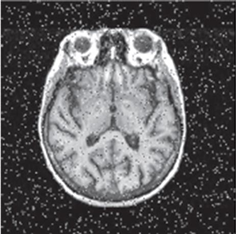
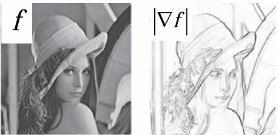

# Aula 04: Máscaras para filtragem e restauração

Nesta aula, focamos na remoção de ruídos em exames de Ressonância Magnética (MRI).

### Máscaras para suavização(Passa-Baixas)
Filtros fundamentais para redução de ruído e suavização de transição.

### *1. Filtro de Média* 
Substitui o valor do pixel pela média aritmética da vizinhança. Útil para ruídos uniformes.
* **Dimensões:** Quanto maior a máscara (ex: $3\times3$ até $35\times35$), maior o efeito de borrão e maior a perda de detalhes e bordas.
### *2. Filtro média ponderada*
 Atribui pesos diferentes, geralmente dando maior importância ao pixel central e seus vizinhos diretos.
* **Filtro gaussiano:** Os pesos seguem uma distribuição Gaussiana, concentrando a influência no centro da máscara.

### *3. Filtro de Mediana:*
 Substitui o valor pelo valor central da vizinhança ordenada. É o método mais eficaz para eliminar o ruído.
* **Eficácia:** É extremamente eficiente na remoção de ruído "Sal e Pimenta" (pontos pretos e brancos), pois esses valores extremos são descartados ao selecionar o valor central da amostra ordenada.

* **Sal e Pimenta:**
 Ruído caracterizado por pontos brancos e pretos. Costumamos remover os ruídos com a mediana(colocar em ordem e pegar o valor central).
  

### Máscara para aguçamento(Passa - Altas)
 **Objetivo:** é **salientar** transições de intensidades, **intensificar** bordas. 
 ### *1. Gradiente*   
 Computa as derivadas parciais nas duas direções(x e y). Nas regiões de borda, como o gradiente é alto, temos a extração da borda.
 
 Como não podemos aplicar derivadas matemáticas em uma grade de pixels, usamos máscaras 3x3 que funcionam como uma aproximação. As mais famosas são:
 * -->Prewitt
 * -->Sobel
  ### *2. Laplaciano* 
  Nos mostra a **segunda derivada**. Ele serve para destacar as áreas de alta frequência(detalhes e contornos),permitindo que médicos visualizem melhor estruturas pequenas que podem estar levemente borradas na imagem original, como microcalcificações ou fissuras ósseas. 
  
